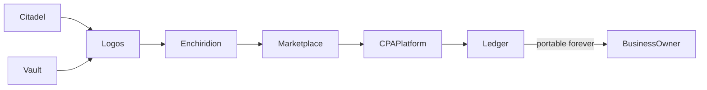

# Logos Tax Systems — Product Architecture
_Last updated: 2026-06-23_

## Brand and Positioning

**Logos Tax Systems** is a portable tax operating system for business owners — powered by AI, executed by CPAs, owned by the business owner forever.

The core problem: tax history and financial context live inside a CPA's systems. When a business owner switches advisors, they start from zero. Logos flips this — the owner owns their data; CPAs get scoped access; when an engagement ends, the owner keeps everything.

Full business context: [`projects/logos-platform/context/business.md`](../projects/logos-platform/context/business.md)

---

## Value Chain

1. **Citadel** — Connect bank accounts, QuickBooks, payroll, and other financial data sources.
2. **Vault** — Upload tax documents and save AI sessions (source material).
3. **Logos** — AI analyzes connected data and documents; conversational advisor surfaces insights.
4. **Enchiridion** — Strategy playbook: synthesized, actionable tax plan with savings, steps, and legal refs. The value-delivery moment.
5. **CPA Marketplace** — Find and engage a CPA to implement strategies.
6. **Ledger** — Permanent, portable tax event timeline — the spine of the product.

---

## Five Product Pillars

| Pillar | What it is | Route(s) | Repo | Maturity |
|--------|-----------|----------|------|----------|
| **Citadel** | Integrations hub — bank (Plaid), QBO, payroll, tax software, IRS. Data intake layer. | `/citadel` | taxpert-therapy | UI shipped; Plaid inline connect not yet wired (links out to `/dashboard/quickbooks`) |
| **Logos** | Conversational AI tax advisor. Analyzes documents + financial data. | `LogosWidget` (global), `/logos`, `/logos/history` | taxpert-therapy + TT-api-core + TT-dev-copilot | Widget + full page shipped |
| **Enchiridion** | Strategy playbook — recommended strategies, savings, implementation steps, legal references. | `/enchiridion` | taxpert-therapy | UI shipped; uses preview/mock data — real Supabase profile wiring pending |
| **Ledger** | Portable tax event timeline. Business events + CPA implementation events. | `/ledger` | taxpert-therapy | Exists; CPA co-write implementation events partial |
| **Vault** | Saved AI sessions + uploaded documents. Feeds Logos. | `/vault`, `/dashboard/documents` | taxpert-therapy | Exists |

### Pillar details

**Citadel** (`components/citadel/CitadelPage.tsx`) — Shows integration cards for Plaid, QuickBooks, payroll, and tax software. Explains how connected data flows into Logos and Enchiridion for precise savings calculations.

**Logos** — Two surfaces:
- **Floating widget** (`components/LogosWidget.tsx`) — Pill → inline chat panel on most pages. "Full page" link opens `/logos`.
- **Full page** (`/logos`) — Split layout: session history sidebar + conversation.

**Enchiridion** (`components/enchiridion/EnchiridionPage.tsx`) — Tax position summary, strategy cards with estimated savings, implementation steps, legal references, and strategy timeline preview. `TaxPositionSummary` routes users here from Logos.

**Ledger** — Permanent record of tax life events. New CPA reads the Ledger and picks up where the last one left off.

**Vault** — Document storage and saved Logos sessions. Not generic file storage — exists to feed AI and give CPAs context.

---

## Three Surfaces

| Surface | Domain | Repo | Local port |
|---------|--------|------|------------|
| Marketing site | logostaxsystems.com | TT-website | 3002 |
| Business owner app | app.logostaxsystems.com | taxpert-therapy | 3003 |
| CPA portal | cpa.logostaxsystems.com | TT-cpa-platform | 3001 |

All three share **TT-api-core** (NestJS backend) and **Supabase** (`yhrbwyarzrjwgkthojzu`). Business owner data is readable by matched CPAs with explicit permission.

---

## UX Architecture (taxpert-therapy)

### Global navigation

`AppHeader` (`components/AppHeader.tsx`) — fixed top nav on authenticated pages:

| Link | Route |
|------|-------|
| Dashboard | `/dashboard` |
| Citadel | `/citadel` |
| Ledger | `/ledger` |
| Enchiridion | `/enchiridion` |
| Vault | `/vault` |
| Advisors | `/dashboard/my-cpas` |

Tagline under logo: *Citadel · Ledger · Enchiridion · Vault*

### Logos widget rules

`LogosWidget` is mounted in `app/layout.tsx` and shown on all pages **except**:

- `/strategies` (and sub-routes)
- `/logos` (and sub-routes)
- `/onboarding` (and sub-routes)

Rationale: Strategy agent and full Logos page are dedicated surfaces; onboarding should not compete with floating chat.

### Strategy agent (separate from Logos)

The **Strategy agent** is the recommendation engine on `/strategies` only. No Logos widget on that page. Strategies are AI-generated recommendations based on the owner's financial profile — not generic advice.

### Dashboard

`/dashboard` (`app/dashboard/page.tsx`) — Journey-oriented home with:
- Onboarding completion flow and document-upload prompts
- Enchiridion preview panel after first document upload
- Contextual CTAs linking Vault, Ledger, and Enchiridion
- Main dashboard view via `ConversationFirstDashboard` (discovery zone, tax position)

---

## End-to-End User Journey

A first-time business owner's path:

1. **Sign up + Onboarding** — Three-step flow (`/onboarding/step1`, `step2`, `step3`). Cream/navy/gold branding. Logos generates a seed insight on completion.
2. **Citadel** — Connect bank accounts (Plaid), QuickBooks, payroll. Real financial data flows in.
3. **Vault** — Upload tax documents (prior returns, formation docs, IRS letters).
4. **Logos** — AI analyzes connected data + documents. Chat surfaces tax position and optimization signals.
5. **Enchiridion** — Synthesized strategy playbook: savings, implementation steps, legal refs. What the owner takes to a CPA.
6. **CPA Marketplace** — Find a CPA filtered by strategy needs. Send engagement request with context.
7. **CPA implements** — CPA uses Enchiridion as the brief, implements strategies, files returns, adds Ledger entries.
8. **Ledger** — Everything recorded. Owner switches CPAs without losing history.

**Key insight:** Enchiridion is the value-delivery moment. Without it, users have conversations (Logos) and timelines (Ledger) but no actionable plan.

---

## CPA Engagement Flow (MVP)

### Shipped (2026-06-17)

| Surface | Implementation |
|---------|----------------|
| BO engagement list | `/dashboard/my-cpas` |
| List engagements | `GET /api/engagement/requests` — merges `member_requests` + `cpa_clients` + `cpa_profiles` |
| End engagement | `POST /api/engagement/end` — body: `{ cpa_id }`, marks `cpa_clients.status = "ended"` |
| Database | `supabase/migrations/20260617_initial_schema.sql` (11 tables) |

Engagement statuses: `request_status` (pending / accepted / declined) and `engagement_status` (active / paused / ended).

### Not yet shipped

- Engagement letter upload (CPA uploads PDF → Vault → BO can view)
- CPA-side end-engagement UI + engagement letter upload
- Data bridge: CPA seeing BO strategies/ledger in TT-cpa-platform
- Enchiridion → marketplace deep link filtered by specialization
- RLS: BO read policy on `cpa_clients`

---

## AI Agents (Product View)

| Agent | User-facing role | Where |
|-------|-----------------|-------|
| **Logos** | Conversational tax advisor for authenticated users | `LogosWidget` + `/logos` |
| **Strategy agent** | Tax strategy recommendation engine | `/strategies` only |
| **IRC Tax Advisor** | Anonymous pre-sales tax Q&A (no login) | TT-website public pages; backed by `tax-advisor` module in TT-api-core |
| **logos-tax-advisor** | GCP ADK agent (IRC RAG + strategy tools) | TT-dev-copilot (`agents/logos-tax-advisor/`) |

Logos and IRC Tax Advisor are intentionally separate: Logos is in-app and profile-aware; IRC Tax Advisor is public pre-sales with anonymous Redis sessions (24h TTL, transfer to 30d on auth).

---

## Naming Conventions

| Name | Meaning |
|------|---------|
| Logos Tax Systems | Brand / product family |
| Citadel | Integrations hub |
| Logos | AI tax advisor (chat) |
| Enchiridion | Strategy playbook (Greek: "handbook") |
| Ledger | Portable tax event timeline |
| Vault | Documents + saved AI sessions |
| taxpert-therapy | Internal repo name for the business owner app |
| TT-cpa-platform | CPA-facing application |

---

## Open Product Gaps (2026-06-23)

| Gap | Status |
|-----|--------|
| CPA access bridge — matched CPA accessing BO data in main app | Partial — engagement MVP exists; full data bridge to CPA platform pending |
| Engagement letter flow | Not built |
| Strategy-to-Marketplace CTA from Enchiridion | Not built |
| Ledger CPA implementation events | Partial — BO events exist; CPA co-write not complete |
| Enchiridion real profile data | Pending — connect to Supabase profile (filing posture, income) |
| Citadel inline Plaid connect | Pending — currently links to `/dashboard/quickbooks` |
| IRS forms (2848, 8821) | Out of scope for MVP |

---

## What We Are NOT

- Not a licensed tax advisor — AI generates strategies to discuss with a CPA
- Not a CPA firm — marketplace CPAs are independent professionals
- Not generic document storage — Vault feeds AI and gives CPAs context

---

## Related Docs

- [Architecture Viewer](./viewer.html) — HTML artifact: full system map + all diagrams
- [Platform System Map](./platform-system-map.md) — source Mermaid for the full repo diagram
- [Technical Architecture](./technical-architecture.md) — repos, APIs, AI layer, infrastructure
- [Business Context](../projects/logos-platform/context/business.md) — pitch, GTM, engagement process detail
- [Active Projects](../context/active-projects.md) — current phase and shipped work
