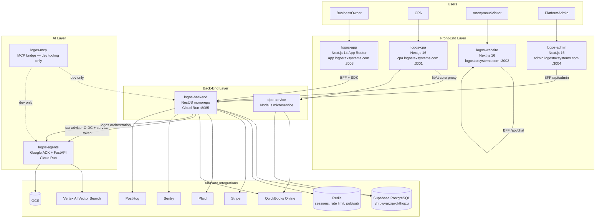
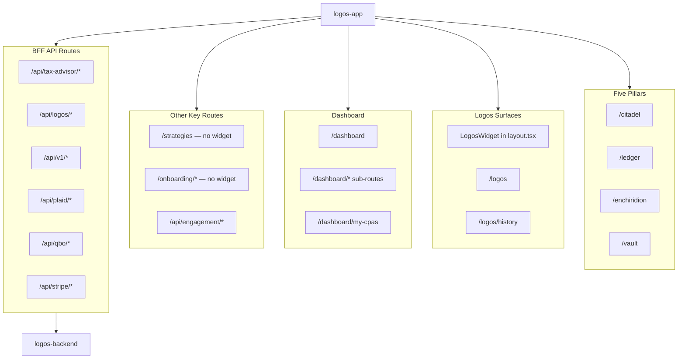
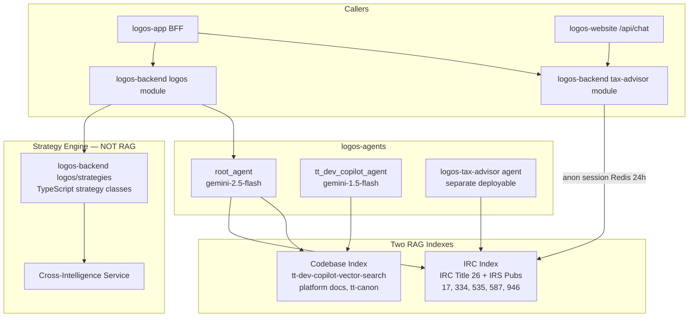

# Logos Tax Systems — Technical Architecture
_Last updated: 2026-08-13_

Engineering reference for repos, APIs, AI layer, and infrastructure. For product pillars and user journeys, see [Product Architecture](./product-architecture.md).

**For the comprehensive all-repos Mermaid diagram** (features + connections across the whole platform), see **[Platform System Map](./platform-system-map.md)**.

---

## Diagram A — Deployment Topology



### Live URLs

| Service | URL |
|---------|-----|
| logos-backend (prod) | `https://tt-api-core-j2wqib4fcq-uk.a.run.app` |
| logos-agents (prod) | `https://tt-dev-copilot-316598874164.us-central1.run.app` |
| Supabase project | `yhrbwyarzrjwgkthojzu` |
| GCP project | `taxpert-therapy-agent-builder` (316598874164) |

---

## Diagram B — logos-app Route Map



### Route inventory

| Area | Routes / files |
|------|----------------|
| Pillars | `/citadel` (FeatureGate), `/enchiridion` (metered: 1 strategy shown, rest blurred), `/ledger`, `/vault` |
| Logos | `LogosWidget` in `app/layout.tsx`; `/logos`, `/logos/history`, `/logos/session/[sessionId]` |
| Dashboard | `/dashboard` — `BusinessOwnerDashboard` (Estimated Opportunity hero, 5 pillar cards, contextual Next Step CTA, recent activity feed) |
| Account | `dashboard/(account)/` route group: `profile`, `subscription`; `settings/` (notifications, security, privacy, data-sharing, usage, support) |
| Strategies | `/strategies`, `/strategies/[id]` — Strategy agent only; Logos widget excluded |
| Onboarding | `/onboarding`, `/onboarding/step1–3` — widget excluded |
| Engagement | `/dashboard/my-cpas`, `/dashboard/find-advisor` (browse), `/dashboard/find-advisor/[cpaId]` (detail); `POST /api/engagement/request`, `GET /api/engagement/advisor/[cpaId]`, `POST /api/engagement/end` |
| Support tickets | `POST /api/support` (create), `GET /api/support` (list), `GET /api/support/[id]` (thread), `POST /api/support/[id]/reply`; `lib/tt-core/support` client |
| Auth | `/login`, `/signup`, `/auth-callback`, `/password-reset` |
| BFF | `/api/tax-advisor/chat`, `session`, `transfer`; `/api/logos/*`; `/api/v1/*`; `/api/plaid/*` (via `lib/tt-core/plaid-bff.ts`); `/api/qbo/*`; `/api/stripe/*`; `/api/support`; `/api/workflows` |

### LogosWidget exclusion paths

From `components/LogosWidget.tsx`:

```typescript
const EXCLUDED_PATHS = ["/strategies", "/logos", "/onboarding"];
```

### Document parser (`lib/logos/`)

Hybrid rule-based + Claude Haiku pipeline for tax document extraction:

| File | Function |
|------|----------|
| `documentExtractor.ts` | Pipeline entry — rule-based first, Haiku fallback for scanned PDFs |
| `parsers/ruleBasedParser.ts` | Deterministic regex extractors; confidence HIGH ≥5 / MEDIUM 2–4 / LOW 0–1 |
| `parsers/claudeHaikuParser.ts` | Claude Haiku vision fallback (~$0.003/doc) |
| `parsers/rules/` | W-2, 1099 variants, Schedule C/E, K-1, Form 1040 |
| `contextAssembler.ts` | Builds `UserTaxContext` patch; `knownFields` for Logos Phase 4 |
| `sanitizePii.ts` | SSN/EIN redaction before Claude |
| `userTaxContextSchema.ts` | Zod schema for `UserTaxContextData` |
| `lib/services/logosContext.service.ts` | `patchUserTaxContext()`, `getOrCreate()` → Supabase |

### API client

`lib/apiCoreClientEnhanced.ts` — typed wrapper around `packages/sdk` for logos-backend calls.

---

## Diagram C — AI and RAG Layer



### Agent models and tools

| Agent | Model | Tools |
|-------|-------|-------|
| `root_agent` | gemini-2.5-flash | Logos context, strategy guarded, `retrieve_docs` (codebase RAG) |
| `tt_dev_copilot_agent` | gemini-1.5-flash | Tier 1: PR read, pytest/jest, lint, DB inspect. Tier 2 (gated): migrations, PR write, dev servers |
| `logos-tax-advisor` | ADK deploy | IRC RAG, strategy tools, context service |

### IRC ingestion

`data_ingestion/irc_ingestion/ingest_irc.py` — downloads IRC XML + IRS HTML pubs, chunks ~800 tokens, embeds with `text-embedding-005`, upserts to Vertex AI Matching Engine.

### Anonymous tax advisor flow

1. Visitor uses IRC widget on logos-website or public pages
2. BFF → `POST /tax-advisor/chat` → logos-backend `tax-advisor` module
3. Session stored in Redis (24h TTL)
4. On auth: `POST /transfer` extends to 30d and links `userId`

---

## Repo Inventory

### 1. `logos-website` — Marketing Site (Next.js 16)

**Domain:** logostaxsystems.com | **Port:** 3002

| Area | Files | Function |
|------|-------|----------|
| Pages | `src/app/page.tsx`, `product`, `for-cpas`, `pricing`, `faq`, `about` | Public marketing |
| Legal | `legal/privacy`, `legal/eula` | Privacy + EULA |
| Product knowledge | `src/data/product-knowledge.ts` | Single source for pre-sale agent copy |
| Blog | `/blog`, `/blog/*` | 6 posts: S-Corp, CPAs, Deductions, Switching CPAs, Doc Lifecycle, Why CPAs Need Logos |
| Waitlist | `/api/waitlist` | Brevo list capture |
| Chat | `/api/chat` | OpenRouter pre-sales chat |
| Community Agent | `/community` — public unauthenticated demo chat (WEB-10); 2-turn limit, optional lead-capture form (name/email/phone), proxies to logos-backend community-leads API via shared secret |
| Observability | `sentry.{client,server,edge}.config.ts`, `PostHogProvider` | Error tracking + analytics |
| Branding | Favicon updated to three-stripes brand mark; About page team photos (Abhishek + David) |

Redirects: `/login` → app subdomain, `/signup` → app subdomain.

---

### 2. `logos-app` — Business Owner App (Next.js 14)

**Domain:** app.logostaxsystems.com | **Port:** 3003

See [Diagram B](#diagram-b--taxpert-therapy-route-map) and [Product Architecture](./product-architecture.md) for UX rules.

Key integrations: Supabase auth, logos-backend SDK, Plaid (via `lib/tt-core/plaid-bff.ts`), QBO, Stripe.

Platform admin UI **removed** — use `logos-admin` at `admin.logostaxsystems.com`. Set `NEXT_PUBLIC_ADMIN_PORTAL_URL` for tax-pro banner.

#### Key modules added / changed (post-2026-07-22)

| Change | Details |
|--------|---------|
| SMS Phase 1 (AG-1) | Twilio inbound webhook at `/api/sms/inbound` — signature validation, identity lookup, TCPA opt-in check, chunked outbound SMS; `/api/sms/link-phone` (link/unlink E.164 phone); `db/migrations/025_sms_identities.sql` (sms_identities table + profiles.sms_opt_in + RLS); `lib/sms/twilio.ts`; ProfileEditForm SMS Connect card |
| Vault validated ingestion | `validateClaim.ts` (Haiku-based content-claim check + entity extraction); `db/migrations/027_vault_doc_extractions.sql`; chunk/embed gated behind human approve/reject; fact reconciliation via `detectFieldConflicts()`/`patchUserTaxContextWithConflicts()` |
| Logos chat file attachment | File + image attachment directly in Logos chat interface |
| CPA advisor ranking | Matching score algorithm + AI Recommended Match badge on find-advisor browse page |
| Tax calendar | Personalized tax calendar; Vercel cron for daily reminders; dynamic database deadlines (tax_deadlines table) |
| Onboarding hard gate | Forced-onboarding gate applied to every protected page, not just `/dashboard` |

#### Key modules (post-2026-06-23)

| Change | Details |
|--------|---------|
| `BusinessOwnerDashboard` | Replaces `ConversationFirstDashboard`; Estimated Opportunity hero, 5 pillar cards with stats, contextual Next Step CTA, recent activity feed |
| `dashboard/(account)/` route group | `profile`, `subscription`, `settings/*` (notifications, security, privacy, data-sharing, usage, support) |
| `components/settings/*` | `NotificationsPanel`, `SecurityPanel`, `SettingsNav`, `SettingsShell`, `SupportPanel`, `UsagePanel` |
| `components/dashboard/AccountGuidanceStrip` | Contextual guidance bar on dashboard |
| Auth-gated Stripe cancel | `subscription-status` GET/DELETE require session ownership |
| `FeatureGate` + `UpgradePrompt` | Gate on Enchiridion + Citadel pages; rate limit + auth on strategy agent chat |
| Plaid BFF refactor | `lib/tt-core/plaid-bff.ts` + status endpoint; legacy `lib/integrations/plaid.ts` removed |
| `packages/shared/src/core/` | New types: `enums.ts`, `financial-data.ts`, `tax-strategy.ts`, `user-profile.ts` |
| `lib/demoMode.ts` | Demo mode utilities |
| Support request API | `app/api/support/route.ts` → Supabase |
| DB migrations | `013_support_requests.sql`, `014_profile_tax_fields.sql` |
| Admin components removed | `AdminDashboard`, `AdminNotifications`, `OrgListPanel`, `OrgDetailPanel`, `ApiCoreMonitoringPanel`, `StrategiesChart`, `StrategyImporter`, `UserManagementPanel` — now in logos-admin |

---

### 3. `logos-admin` — Platform Super-Admin (Next.js 16)

**Domain:** admin.logostaxsystems.com | **Port:** 3004

| Area | Routes |
|------|--------|
| Overview | `/overview` |
| Orgs | `/orgs` (paginated + filters), `/orgs/[id]` (feature flags, PLAN_FEATURE_DEFAULTS, override indicators) |
| Users | `/users`, `/users/[id]` (paginated + filters) |
| Audit | `/audit` (date range, actor, entity type filters) |
| Engagements | `/engagements` (paginated) |
| CPA moderation | `/cpas` (paginated), `/cpas/:id` (profile, engagements, verification tabs) |
| Support queue | `/support` — `SupportQueuePanel` (status/priority filters, search), `TicketDetailPanel` (threaded messages, internal notes, status/priority controls, Linear escalation) |
| Architecture viewer | `/architecture` — embedded Mermaid viewer from `public/architecture/viewer.html` |
| Admin RBAC | `/settings/admins` |
| System Health | `/health` — live health dashboard: 10 targets (4 frontends × dev/prod + backend dev/prod), GCP identity tokens minted server-side, parallel-fetch API route |
| Community leads | `/community-leads` (ADM-7) — admin visibility for community leads captured via website Community Agent |
| Auth | Branded login/MFA shell, `PasswordField`, forgot password, MFA-aware password reset; Supabase TOTP MFA enrollment + login step-up |

BFF: `/api/admin/*` → logos-backend `/admin/*`. `/api/support/*` → logos-backend support module. Engagements/CPAs use Supabase service role.

Auth: `app_metadata.platform_role` (`super_admin` | `platform_admin` | `support` | `readonly`).

---

### 4. `logos-backend` — Core Backend (NestJS Monorepo)

**Port:** 8085 (local) | **Prod:** Cloud Run UK

#### `apps/api` modules

| Module | Function |
|--------|----------|
| `auth` | JWT sign/verify, token blacklist (Redis), Supabase user sync |
| `orgs` | Multi-tenant provisioning (`@Global()` — required for UserJwtGuard DI) |
| `workspaces` | Workspace CRUD within an org |
| `cpa` | CPA firm profile get/upsert |
| `invitations` | Team invite send + accept |
| `logos` | AI conversation, strategy classification (RIE), strategy-map |
| `logos/strategies/*` | 11 strategy calculators (Augusta, S-Corp, QBI, etc.) |
| `tax-advisor` | Public IRC widget; anon Redis sessions; session transfer |
| `event-bridge` | Outbound webhooks, HMAC signing, Redis pub/sub |
| `ai` | LLM utilities: categorize, analyze, deductions, risk, receipt, strategies |
| `llm` | Anthropic + OpenAI abstraction (`LLMRouterService`) |
| `billing` | Stripe subscriptions, webhooks |
| `entitlements` | Feature gating per tier; `strategyPreviewLimit` (free: 1, paid: unlimited) |
| `plaid` | Bank connection, transaction sync |
| `qbo` | QuickBooks OAuth, data pull |
| `tax-analytics` | Strategy scoring, quarterly projections |
| `threads` | Conversation persistence |
| `realtime` | WebSocket push |
| `audit` | Activity tracking |
| `handoffs` | AI → CPA escalation |
| `support` | Customer service tickets — category, priority, subject, body; escalate to Linear; stats endpoint |
| `notifications` | Email + in-app alerts |
| `admin` | Super-admin APIs |
| `metrics` | Usage + quota enforcement |
| `health` | Liveness/readiness |
| `rie` | Rule-based inference engine |

#### `packages/`

| Package | Function |
|---------|----------|
| `packages/core` | Shared types, enums, plan catalog |
| `packages/sdk` | Auto-generated typed API client → consumed by logos-app |

**Note:** Tenant isolation via Prisma middleware (`apps/api/src/common/tenant.prisma-middleware.ts`). dotenv loads from monorepo root via `process.cwd()` in `main.ts`.

#### Key modules added / changed (post-2026-07-22)

| Change | Details |
|--------|---------|
| Community leads (BE-5) | Durable `community_leads` table + ingestion API; `COMMUNITY_LEADS` entitlement tier; `adminListLeads` endpoint; Community Agent proxies lead capture from logos-website |
| Encryption hardening (SEC-1) | Versioned encryption envelope (AES-256-GCM), salt extracted to env var, re-encryption migration script |
| Cloud Run RAG decommission | Removed decommissioned Cloud Run RAG backend call from `tax-advisor` service |
| Sentry Docker fix (SEC-4) | Production Docker image was silently dropping `@sentry/node` during pnpm monorepo build — fixed Dockerfile multi-stage |
| Dependency remediation | 124 → 9 vulnerabilities resolved via `pnpm audit --fix` |

#### Key modules (post-2026-06-23)

| Change | Details |
|--------|---------|
| Sentry error tracking | `@sentry/nestjs` + profiling, initialized before `NestFactory.create` when `SENTRY_DSN` set |
| PostHog analytics | `apps/api/src/common/posthog.service.ts` — `capture`, `identify`, `groupIdentify`; gated on `POSTHOG_API_KEY` |
| FastifyAdapter rawBody fix | Moved from adapter constructor to `NestFactory.create` options (NestJS v10 compat) |
| `strategyPreviewLimit` | `packages/core/plans/catalog.ts` + `types/plans.ts` + `apply-plan-defaults.ts`; free tier: 1 preview, paid: `null` (unlimited) |
| `cloud-run-auth.ts` | `apps/api/src/common/cloud-run-auth.ts` — OIDC token + `X-TT-Service-Token` split for tax-advisor → logos-agents calls |
| `logos-confidence.guard.ts` | `modules/logos/guards/` — confidence gating on Logos responses |
| `user-tax-context.service.ts` | `modules/logos/services/` — UserTaxContext management within logos module |
| Plaid/QBO webhook hardening | Webhooks bootstrap tenant context; HMAC verifiers hardened |
| `X-Logos-Subject-User-Id` | Logos profile binding via request header |
| Rate limit middleware | Now wired in `app.module.ts` |
| Billing idempotency | `billing.service.ts` hardened for duplicate webhook events |
| Prisma schema | New fields; new migration in `prisma/migrations/` |
| `scripts/sync-core-to-therapy.mjs` | Sync plan catalog from logos-backend to logos-app |
| `scripts/backfill-subscriptions-from-therapy.mjs` | One-time backfill |
| `docs/RUNBOOK-DATABASE-CUTOVER.md` | Database migration runbook |

---

### 5. `logos-cpa` — CPA Portal + QBO Microservice

**Domain:** cpa.logostaxsystems.com | **Port:** 3001

#### `cpa-platform` (Next.js 16)

| Area | Function |
|------|----------|
| Landing | `/` — Logos Tax Systems marketing (navy/gold) |
| Dashboard | 4-stat row, pending requests, recent clients |
| FirmClients CRM | `/dashboard/clients`, client profiles, notes, `ClientDocuments` (engagement letter upload → private storage bucket), `ClientTaxProfile` (reads BO profile via admin client) |
| Ask Logos tab | CPA "Ask Logos" chat tab in client detail view — calls logos-app's `/api/logos/v2/cpa-chat` with CPA's Supabase access_token; locked when `context_access_granted = false` |
| Access-grant toggle | `context_access_granted` schema in `cpa_clients` — CPA must explicitly grant context before Tax Profile / Ask Logos tabs unlock |
| Request queue | Accept/decline with `InlineRequestActions` |
| Tax Return Kanban | `/dashboard/returns` — 9-column Kanban, overdue detection |
| Earnings | `/dashboard/earnings` — monthly/YTD, per-client breakdown |
| Marketplace | `/marketplace`, `/marketplace/[cpaId]` |
| Handoffs | `/api/handoffs/sync` → logos-backend |
| Service modules | `src/modules/identity/`, `clients/`, `returns/` |
| TT-core client | `lib/tt-core/client.ts`, `server.ts` — proxy to logos-backend |

#### `qbo-service` (Node.js)

| File | Function |
|------|----------|
| `QBOSyncService.js` | Pull accounts, transactions, P&L |
| `WebhookHandler.js` | QBO change webhooks |
| `ScheduledJobProcessor.js` | Nightly full syncs |
| `TaxAnalyticsProcessor.js` | Classify transactions |

---

### 6. `logos-agents` — AI Agents (Google ADK + FastAPI)

**GCP:** Cloud Run us-central1

| Component | Path | Function |
|-----------|------|----------|
| Root agent | `app/agent.py` | `root_agent` + `tt_dev_copilot_agent` |
| Logos tax advisor | `agents/logos-tax-advisor/` | Separate deployable ADK agent |
| Codebase RAG | `app/retrievers.py` | Platform docs index |
| IRC RAG | `app/irc_retriever.py` | Tax law index |
| Logos tools | `app/logos_context_tools.py`, `strategy_engine_tools.py` | Context + guarded strategy/ROI |
| Zeno | `zeno_bot.py` | Slack entrypoint |

**Note (2026-07-29):** Orphaned agent scaffolds and `dev-copilot` toolset (github_tools.py, test_execution_tools.py, database_tools.py, server_management_tools.py) removed. Cloud Run deploy workflows disabled after GCP Cloud Run decommission — logos-tax-advisor now served via Vercel/pgvector, not Cloud Run.

---

### 7. `logos-mcp` — MCP Bridge (Dev Tooling)

**Not a production user path.** Exposes TT platform to Cursor/IDE via Model Context Protocol.

Configured in workspace `.mcp.json`. Proxies to:
- logos-backend (`TT_API_URL`)
- logos-app BFF (`TT_BFF_URL`)
- Logos ADK backend (`LOGOS_BACKEND_URL`)

Tools include `logos_agent_chat` (`src/tools/logos-agent.ts`).

---

## Changelog (2026-07-22 → 2026-08-13)

| Area | Change |
|------|--------|
| logos-app | SMS Phase 1 (AG-1) — Twilio webhook `/api/sms/inbound`, link-phone API `/api/sms/link-phone`, `sms_identities` table (migration 025), `lib/sms/twilio.ts`, ProfileEditForm SMS Connect card with TCPA consent |
| logos-app | Vault validated ingestion — `validateClaim.ts` (Haiku content-claim + entity extraction), `vault_document_extractions` table (migration 027), human approve/reject gate before chunk/embed, fact reconciliation |
| logos-app | Logos chat file/image attachment |
| logos-app | CPA advisor ranking — matching score + AI Recommended Match badge on find-advisor browse |
| logos-app | Tax calendar — personalized, Vercel cron daily reminders, dynamic `tax_deadlines` table |
| logos-app | Onboarding hard gate — forced-onboarding applied to every protected route |
| logos-app | SMS security — brute-force lockout, OTP rate limiting, idle re-auth |
| logos-backend | Community leads (BE-5) — durable storage, ingestion API, COMMUNITY_LEADS tier, `adminListLeads` |
| logos-backend | Encryption hardening (SEC-1) — versioned AES-256-GCM envelope, salt-to-env, re-encryption migration |
| logos-backend | Decommissioned Cloud Run RAG call removed from `tax-advisor` module |
| logos-backend | Sentry Docker fix (SEC-4) — production image now correctly includes `@sentry/node` |
| logos-backend | Dependency vulnerabilities: 124 → 9 via `pnpm audit --fix` |
| logos-cpa | CPA "Ask Logos" chat tab — calls logos-app `/api/logos/v2/cpa-chat` with CPA Bearer token; locked when context not granted |
| logos-cpa | CPA access-grant toggle — `context_access_granted` column in `cpa_clients`; gates Tax Profile + Ask Logos tabs |
| logos-admin | System Health dashboard `/health` — 10 targets, GCP identity tokens, parallel-fetch |
| logos-admin | Community leads panel (ADM-7) |
| logos-admin | Admin MFA — Supabase TOTP enrollment + login step-up; branded auth shell |
| logos-agents | Orphaned scaffolds + dev-copilot toolset removed; Cloud Run deploy workflows disabled |
| logos-website | Community Agent `/community` — public demo chat, 2-turn limit, lead-capture form, proxies to logos-backend |
| logos-website | About page team photos; favicon → three-stripes brand mark |

## Changelog (2026-07-02 → 2026-07-22)

| Area | Change |
|------|--------|
| logos-app | Find-advisor marketplace — `/dashboard/find-advisor` browse + `/dashboard/find-advisor/[cpaId]` detail; `/api/engagement/request` + `/api/engagement/advisor/[cpaId]` |
| logos-app | Enchiridion metered gating — first strategy shown fully, remaining blurred with lock icon (strategyPreviewLimit enforced in UI) |
| logos-app | Support ticket UI — create ticket, thread view with message history, reply to reopen; `tt-core/support` client methods |
| logos-app | Real Sentry instrumentation (`sentry.client/server/edge.config.ts`) replacing stub `lib/sentry-config.ts` |
| logos-backend | `support` module — tickets with category, priority, subject, body; escalate to Linear; stats endpoint for admin |
| logos-backend | PostHog events for Logos strategy analysis and QBO sync |
| logos-backend | `req.originalUrl` fix — path-based tier routing now correct (was broken by Fastify middleware rewriting `req.url` → `'/'`) |
| logos-backend | Cloud Run secrets: `PLAID_CLIENT_ID`/`PLAID_SECRET` added |
| logos-cpa | `ClientDocuments` — engagement letter upload sub-component + endpoint; private `client-documents` storage bucket |
| logos-cpa | `ClientTaxProfile` tab — CPA reads BO profile via admin client |
| logos-cpa | Sentry + PostHog instrumentation added |
| logos-admin | Phase 1+1.5+2: pagination + filters on all list panels (Orgs, Users, Audit, CPAs, Engagements) |
| logos-admin | CPA detail page `/cpas/:id` — profile, engagements, verification tabs |
| logos-admin | Support ticket queue — `SupportQueuePanel`, `TicketDetailPanel` (threaded messages, internal notes, Linear escalation) |
| logos-admin | `OrgDetailPanel` — feature flag toggles, `PLAN_FEATURE_DEFAULTS` map, reset-to-defaults button, override indicators |
| logos-admin | `/architecture` route — embedded architecture viewer from `public/architecture/viewer.html` |
| logos-admin | Dev-login auth bypass routes removed (security fix) |
| logos-admin | Sentry + PostHog instrumentation added |
| logos-website | Blog section — `/blog` with 6 posts (S-Corp, CPAs, Deductions, Switching CPAs, Doc Lifecycle, Why CPAs Need Logos) |
| logos-website | Sentry + PostHog instrumentation; nav/footer Blog links |

## Changelog (2026-06-23 → 2026-07-02)

| Area | Change |
|------|--------|
| logos-app | `BusinessOwnerDashboard` — Estimated Opportunity hero, 5 pillar cards, contextual CTA, recent activity feed |
| logos-app | `dashboard/(account)/` route group — profile, subscription, settings (notifications, security, privacy, data-sharing, usage, support) |
| logos-app | Auth-gated Stripe cancel; Logos BFF routing fix |
| logos-app | `FeatureGate` + `UpgradePrompt` on Enchiridion + Citadel; rate limit + auth on strategy agent chat |
| logos-app | Plaid BFF refactor (`lib/tt-core/plaid-bff.ts`); legacy `lib/integrations/plaid.ts` removed |
| logos-app | `packages/shared/src/core/` — enums, financial-data, tax-strategy, user-profile types |
| logos-app | Admin panel components fully removed; `demoMode.ts` added |
| logos-app | DB migrations `013_support_requests.sql`, `014_profile_tax_fields.sql` |
| logos-backend | Sentry error tracking + profiling |
| logos-backend | PostHog analytics service (`posthog.service.ts`) |
| logos-backend | `strategyPreviewLimit` in plan catalog (free: 1, paid: unlimited) |
| logos-backend | Cloud Run OIDC + service token split (`cloud-run-auth.ts`) |
| logos-backend | Logos confidence guard, user-tax-context service in logos module |
| logos-backend | Plaid/QBO webhook tenant bootstrapping; billing idempotency hardening |
| logos-backend | `RUNBOOK-DATABASE-CUTOVER.md`; sync + backfill scripts |
| logos-cpa | Org bootstrap fix; marketplace view fix; API ownership checks |
| logos-agents | Cloud Run OIDC split; `fix-cloudrun.sh` maintenance script |

## Changelog (2026-06-09 → 2026-06-23)

| Area | Change |
|------|--------|
| Admin portal | **logos-admin** fourth frontend at `admin.logostaxsystems.com` :3004; platform admin removed from therapy + CPA |
| Product model | Five pillars: Citadel, Logos, Enchiridion, Ledger, Vault |
| logos-app | `/citadel`, `/enchiridion` pages; `AppHeader` unified nav |
| logos-app | `LogosWidget` floating chat; `/logos` full page + session history |
| logos-app | Dashboard journey CTAs, Enchiridion preview after upload |
| logos-app | MVP engagement: `/api/engagement/*`, `/dashboard/my-cpas` |
| logos-app | Onboarding rebrand (cream/navy/gold, 3-step flow) |
| logos-app | Supabase migration `20260617_initial_schema.sql` (11 tables) |
| logos-website | Next.js 16 marketing site with product knowledge base |
| logos-cpa | Tax Return Kanban, Earnings page, service modules (unchanged from prior doc) |
| logos-backend | `tax-advisor`, `event-bridge` modules (unchanged from prior doc) |
| logos-agents | `logos-tax-advisor` separate agent; IRC RAG index |
| Architecture docs | Split into product-architecture.md + technical-architecture.md |

---

## Known Technical Debt and Blockers

| Item | Impact |
|------|--------|
| Prisma `filename` column missing on `LogosSession` | `/logos` session history broken until migration |
| logos-backend PR #9 rebase conflict | Blocks PRs #10–#12 |
| RLS: BO read policy on `cpa_clients` | Engagement visibility gaps |
| Redis not provisioned in prod | Token blacklist + anon sessions degrade gracefully locally |
| Single Supabase project for all envs | Needs staging/prod split before beta |
| `RATE_LIMIT_ENABLED=false` locally | Production rate limits not validated |

---

## Security and Multi-Tenancy

- Multi-tenant from day one: `OrgsModule`, tenant Prisma middleware
- Each AI agent persona has isolated tool sets and IAM boundaries (see `logos-agents/tt-canon/03-agents/architecture.md`)
- PII sanitized before any document text → Claude (`sanitizePii.ts`)
- Engagement APIs use service role to bypass CPA-only RLS where needed

---

## Related Docs

- [Product Architecture](./product-architecture.md) — pillars, journeys, UX rules
- [Business Context](../projects/logos-platform/context/business.md)
- [Repos Reference](../projects/logos-platform/context/repos.md)
- [logos-agents Agent Canon](../TT-dev-copilot/tt-canon/03-agents/architecture.md)

### Re-indexing for Dev Copilot RAG

After architecture changes, re-ingest into codebase vector search:

```bash
cd logos-agents
python data_ingestion/upload_docs_direct.py
```
