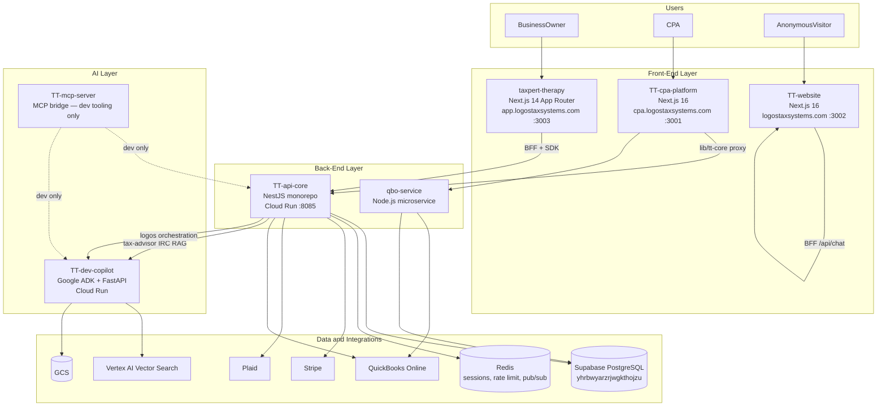
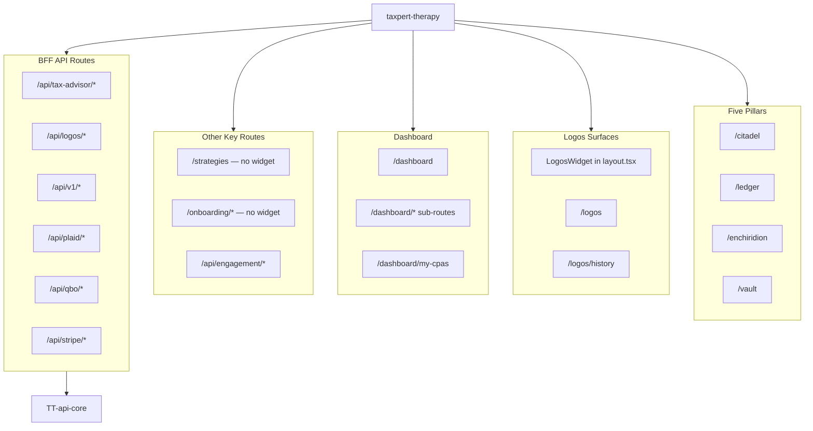
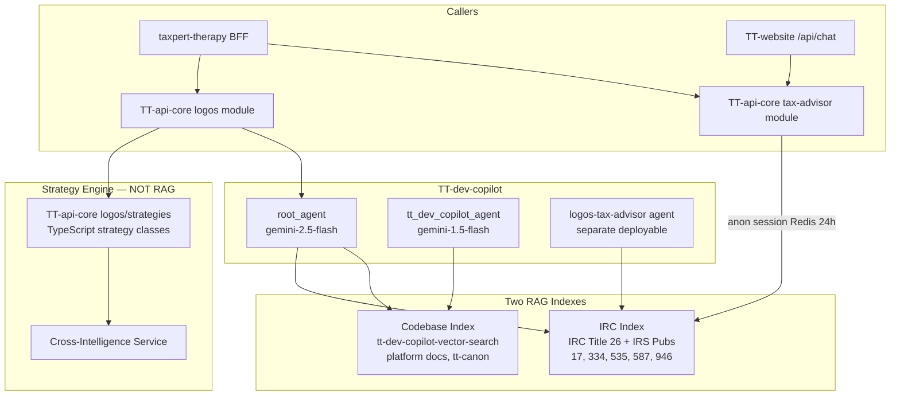

# Logos Tax Systems — Technical Architecture
_Last updated: 2026-06-23_

Engineering reference for repos, APIs, AI layer, and infrastructure. For product pillars and user journeys, see [Product Architecture](./product-architecture.md).

**For the comprehensive all-repos Mermaid diagram** (features + connections across the whole platform), see **[Platform System Map](./platform-system-map.md)**.

---

## Diagram A — Deployment Topology



### Live URLs

| Service | URL |
|---------|-----|
| TT-api-core (prod) | `https://tt-api-core-j2wqib4fcq-uk.a.run.app` |
| TT-dev-copilot (prod) | `https://tt-dev-copilot-316598874164.us-central1.run.app` |
| Supabase project | `yhrbwyarzrjwgkthojzu` |
| GCP project | `taxpert-therapy-agent-builder` (316598874164) |

---

## Diagram B — taxpert-therapy Route Map



### Route inventory

| Area | Routes / files |
|------|----------------|
| Pillars | `/citadel`, `/enchiridion`, `/ledger`, `/vault` |
| Logos | `LogosWidget` in `app/layout.tsx`; `/logos`, `/logos/history`, `/logos/session/[sessionId]` |
| Dashboard | `/dashboard` (journey home + `ConversationFirstDashboard`); sub-routes: `profile`, `documents`, `my-cpas`, `bank-analysis`, `subscription`, `quickbooks`, etc. |
| Strategies | `/strategies`, `/strategies/[id]` — Strategy agent only; Logos widget excluded |
| Onboarding | `/onboarding`, `/onboarding/step1–3` — widget excluded |
| Engagement | `GET /api/engagement/requests`, `POST /api/engagement/end` |
| Auth | `/login`, `/signup`, `/auth-callback`, `/password-reset` |
| BFF | `/api/tax-advisor/chat`, `session`, `transfer`; `/api/logos/*`; `/api/v1/*`; `/api/plaid/*`; `/api/qbo/*`; `/api/stripe/*` |

### LogosWidget exclusion paths

From `components/LogosWidget.tsx`:

```typescript
const EXCLUDED_PATHS = ["/strategies", "/logos", "/onboarding"];
```

### Document parser (`lib/logos/`)

Hybrid rule-based + Claude Haiku pipeline for tax document extraction:

| File | Function |
|------|----------|
| `documentExtractor.ts` | Pipeline entry — rule-based first, Haiku fallback for scanned PDFs |
| `parsers/ruleBasedParser.ts` | Deterministic regex extractors; confidence HIGH ≥5 / MEDIUM 2–4 / LOW 0–1 |
| `parsers/claudeHaikuParser.ts` | Claude Haiku vision fallback (~$0.003/doc) |
| `parsers/rules/` | W-2, 1099 variants, Schedule C/E, K-1, Form 1040 |
| `contextAssembler.ts` | Builds `UserTaxContext` patch; `knownFields` for Logos Phase 4 |
| `sanitizePii.ts` | SSN/EIN redaction before Claude |
| `userTaxContextSchema.ts` | Zod schema for `UserTaxContextData` |
| `lib/services/logosContext.service.ts` | `patchUserTaxContext()`, `getOrCreate()` → Supabase |

### API client

`lib/apiCoreClientEnhanced.ts` — typed wrapper around `packages/sdk` for TT-api-core calls.

---

## Diagram C — AI and RAG Layer



### Agent models and tools

| Agent | Model | Tools |
|-------|-------|-------|
| `root_agent` | gemini-2.5-flash | Logos context, strategy guarded, `retrieve_docs` (codebase RAG) |
| `tt_dev_copilot_agent` | gemini-1.5-flash | Tier 1: PR read, pytest/jest, lint, DB inspect. Tier 2 (gated): migrations, PR write, dev servers |
| `logos-tax-advisor` | ADK deploy | IRC RAG, strategy tools, context service |

### IRC ingestion

`data_ingestion/irc_ingestion/ingest_irc.py` — downloads IRC XML + IRS HTML pubs, chunks ~800 tokens, embeds with `text-embedding-005`, upserts to Vertex AI Matching Engine.

### Anonymous tax advisor flow

1. Visitor uses IRC widget on TT-website or public pages
2. BFF → `POST /tax-advisor/chat` → TT-api-core `tax-advisor` module
3. Session stored in Redis (24h TTL)
4. On auth: `POST /transfer` extends to 30d and links `userId`

---

## Repo Inventory

### 1. `TT-website` — Marketing Site (Next.js 16)

**Domain:** logostaxsystems.com | **Port:** 3002

| Area | Files | Function |
|------|-------|----------|
| Pages | `src/app/page.tsx`, `product`, `for-cpas`, `pricing`, `faq`, `about` | Public marketing |
| Legal | `legal/privacy`, `legal/eula` | Privacy + EULA |
| Product knowledge | `src/data/product-knowledge.ts` | Single source for pre-sale agent copy |
| Waitlist | `/api/waitlist` | Brevo list capture |
| Chat | `/api/chat` | OpenRouter pre-sales chat |

Redirects: `/login` → app subdomain, `/signup` → app subdomain.

---

### 2. `taxpert-therapy` — Business Owner App (Next.js 14)

**Domain:** app.logostaxsystems.com | **Port:** 3003

See [Diagram B](#diagram-b--taxpert-therapy-route-map) and [Product Architecture](./product-architecture.md) for UX rules.

Key integrations: Supabase auth, TT-api-core SDK, Plaid, QBO, Stripe.

---

### 3. `TT-api-core` — Core Backend (NestJS Monorepo)

**Port:** 8085 (local) | **Prod:** Cloud Run UK

#### `apps/api` modules

| Module | Function |
|--------|----------|
| `auth` | JWT sign/verify, token blacklist (Redis), Supabase user sync |
| `orgs` | Multi-tenant provisioning (`@Global()` — required for UserJwtGuard DI) |
| `workspaces` | Workspace CRUD within an org |
| `cpa` | CPA firm profile get/upsert |
| `invitations` | Team invite send + accept |
| `logos` | AI conversation, strategy classification (RIE), strategy-map |
| `logos/strategies/*` | 11 strategy calculators (Augusta, S-Corp, QBI, etc.) |
| `tax-advisor` | Public IRC widget; anon Redis sessions; session transfer |
| `event-bridge` | Outbound webhooks, HMAC signing, Redis pub/sub |
| `ai` | LLM utilities: categorize, analyze, deductions, risk, receipt, strategies |
| `llm` | Anthropic + OpenAI abstraction (`LLMRouterService`) |
| `billing` | Stripe subscriptions, webhooks |
| `entitlements` | Feature gating per tier |
| `plaid` | Bank connection, transaction sync |
| `qbo` | QuickBooks OAuth, data pull |
| `tax-analytics` | Strategy scoring, quarterly projections |
| `threads` | Conversation persistence |
| `realtime` | WebSocket push |
| `audit` | Activity tracking |
| `handoffs` | AI → CPA escalation |
| `notifications` | Email + in-app alerts |
| `admin` | Super-admin APIs |
| `metrics` | Usage + quota enforcement |
| `health` | Liveness/readiness |
| `rie` | Rule-based inference engine |

#### `packages/`

| Package | Function |
|---------|----------|
| `packages/core` | Shared types, enums, plan catalog |
| `packages/sdk` | Auto-generated typed API client → consumed by taxpert-therapy |

**Note:** Tenant isolation via Prisma middleware (`apps/api/src/common/tenant.prisma-middleware.ts`). dotenv loads from monorepo root via `process.cwd()` in `main.ts`.

---

### 4. `TT-cpa-platform` — CPA Portal + QBO Microservice

**Domain:** cpa.logostaxsystems.com | **Port:** 3001

#### `cpa-platform` (Next.js 16)

| Area | Function |
|------|----------|
| Landing | `/` — Logos Tax Systems marketing (navy/gold) |
| Dashboard | 4-stat row, pending requests, recent clients |
| FirmClients CRM | `/dashboard/clients`, client profiles, notes |
| Request queue | Accept/decline with `InlineRequestActions` |
| Tax Return Kanban | `/dashboard/returns` — 9-column Kanban, overdue detection |
| Earnings | `/dashboard/earnings` — monthly/YTD, per-client breakdown |
| Marketplace | `/marketplace`, `/marketplace/[cpaId]` |
| Handoffs | `/api/handoffs/sync` → TT-api-core |
| Service modules | `src/modules/identity/`, `clients/`, `returns/` |
| TT-core client | `lib/tt-core/client.ts`, `server.ts` — proxy to TT-api-core |

#### `qbo-service` (Node.js)

| File | Function |
|------|----------|
| `QBOSyncService.js` | Pull accounts, transactions, P&L |
| `WebhookHandler.js` | QBO change webhooks |
| `ScheduledJobProcessor.js` | Nightly full syncs |
| `TaxAnalyticsProcessor.js` | Classify transactions |

---

### 5. `TT-dev-copilot` — AI Agents (Google ADK + FastAPI)

**GCP:** Cloud Run us-central1

| Component | Path | Function |
|-----------|------|----------|
| Root agent | `app/agent.py` | `root_agent` + `tt_dev_copilot_agent` |
| Logos tax advisor | `agents/logos-tax-advisor/` | Separate deployable ADK agent |
| Codebase RAG | `app/retrievers.py` | Platform docs index |
| IRC RAG | `app/irc_retriever.py` | Tax law index |
| Logos tools | `app/logos_context_tools.py`, `strategy_engine_tools.py` | Context + guarded strategy/ROI |
| Dev tools | `github_tools.py`, `test_execution_tools.py`, `database_tools.py`, `server_management_tools.py` | PR, test, DB, server management |
| Zeno | `zeno_bot.py` | Slack entrypoint |

---

### 6. `TT-mcp-server` — MCP Bridge (Dev Tooling)

**Not a production user path.** Exposes TT platform to Cursor/IDE via Model Context Protocol.

Configured in workspace `.mcp.json`. Proxies to:
- TT-api-core (`TT_API_URL`)
- taxpert-therapy BFF (`TT_BFF_URL`)
- Logos ADK backend (`LOGOS_BACKEND_URL`)

Tools include `logos_agent_chat` (`src/tools/logos-agent.ts`).

---

## Changelog (2026-06-09 → 2026-06-23)

| Area | Change |
|------|--------|
| Product model | Five pillars: Citadel, Logos, Enchiridion, Ledger, Vault |
| taxpert-therapy | `/citadel`, `/enchiridion` pages; `AppHeader` unified nav |
| taxpert-therapy | `LogosWidget` floating chat; `/logos` full page + session history |
| taxpert-therapy | Dashboard journey CTAs, Enchiridion preview after upload |
| taxpert-therapy | MVP engagement: `/api/engagement/*`, `/dashboard/my-cpas` |
| taxpert-therapy | Onboarding rebrand (cream/navy/gold, 3-step flow) |
| taxpert-therapy | Supabase migration `20260617_initial_schema.sql` (11 tables) |
| TT-website | Next.js 16 marketing site with product knowledge base |
| TT-cpa-platform | Tax Return Kanban, Earnings page, service modules (unchanged from prior doc) |
| TT-api-core | `tax-advisor`, `event-bridge` modules (unchanged from prior doc) |
| TT-dev-copilot | `logos-tax-advisor` separate agent; IRC RAG index |
| Architecture docs | Split into product-architecture.md + technical-architecture.md |

---

## Known Technical Debt and Blockers

| Item | Impact |
|------|--------|
| Prisma `filename` column missing on `LogosSession` | `/logos` session history broken until migration |
| TT-api-core PR #9 rebase conflict | Blocks PRs #10–#12 |
| RLS: BO read policy on `cpa_clients` | Engagement visibility gaps |
| Redis not provisioned in prod | Token blacklist + anon sessions degrade gracefully locally |
| Single Supabase project for all envs | Needs staging/prod split before beta |
| `RATE_LIMIT_ENABLED=false` locally | Production rate limits not validated |

---

## Security and Multi-Tenancy

- Multi-tenant from day one: `OrgsModule`, tenant Prisma middleware
- Each AI agent persona has isolated tool sets and IAM boundaries (see `TT-dev-copilot/tt-canon/03-agents/architecture.md`)
- PII sanitized before any document text → Claude (`sanitizePii.ts`)
- Engagement APIs use service role to bypass CPA-only RLS where needed

---

## Related Docs

- [Product Architecture](./product-architecture.md) — pillars, journeys, UX rules
- [Business Context](../projects/logos-platform/context/business.md)
- [Repos Reference](../projects/logos-platform/context/repos.md)
- [TT-dev-copilot Agent Canon](../TT-dev-copilot/tt-canon/03-agents/architecture.md)

### Re-indexing for Dev Copilot RAG

After architecture changes, re-ingest into codebase vector search:

```bash
cd TT-dev-copilot
python data_ingestion/upload_docs_direct.py
```
